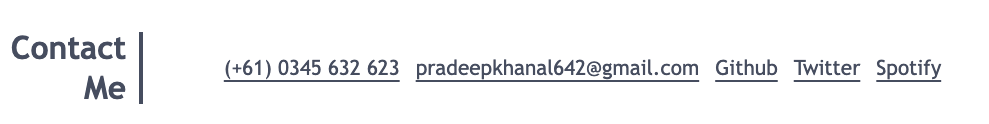

# My Portfolio Website

Welcome to my professional portfolio website. I have used HTML and CSS to create this website. It serves as a showcase of my work, skills, and experiences. The design inspiration of this portfolio website has been taken from University of Sydney Bootcamp Course.

_Description: The hero section showcases the easy navigation bar and hero section._

_Description: The work section showcases the work that I have done so far._

_Description: The footer section showcases the contact me banner with all the social links._

## Description

You can navigate in my portfolio website with the help of navbar, learn about me, see my works and also download my resume.You can also contact me via all the social links provided in the bottom of the page.Overall, its a personal portfolio of mine to describe me and my work in web development so far.

## Live Link

The live version of the website can be accessed <a href="https://pradeepkhanal23.github.io/my-portfolio/" target="_blank">Here</a>

## Installation

To run this project locally, follow these steps:

1. Clone this repository.
2. Open the project directory.
3. Open the `index.html` file in your preferred web browser.

## Technologies Used

- HTML5
- CSS3

## License

Indicate the license under which your project is distributed. For example:

This project is licensed under the [MIT License](LICENSE).
